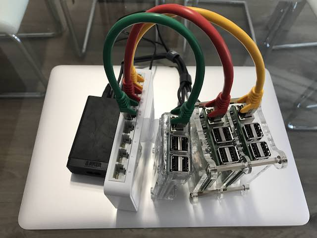

# pihadoop
3 Raspberry in Cluster with hadoop

El objetivo de este proyecto es dejar documentado cada uno de los pasos necesarios para configurar un cluster de 3 o mas raspberries con hadoop y spark.





## Copiar este repositorio
```
#instalar git
sudo apt-get install git

#eliminar version antigua de pihadoop
cd ~
rm -r -f pihadoop
git clone https://github.com/cbrcl/pihadoop
chmod +x pihadoop/config/*.sh

#Ejecutar la actualizacion de paquetes
pihadoop/config/01-raspberry-update.sh

#Ejecutar la creacion del usuario/grupo para hadoop
pihadoop/config/02-raspberry-hadoop-user.sh

#Ejecutar la creacion  y configuracion de las carpetas que usara hadoop
pihadoop/config/03-raspberry-hadoop-folders.sh
```
#configurar hadoop
> ver [02-hadoop-master-install.md](02-hadoop-master-install.md)

```
#Ejecutar la ejemplo wordcount
pihadoop/config/04-example-mapreduce.sh

#Arrancar hdfs
pihadoop/config/hadoop-start.sh
```
